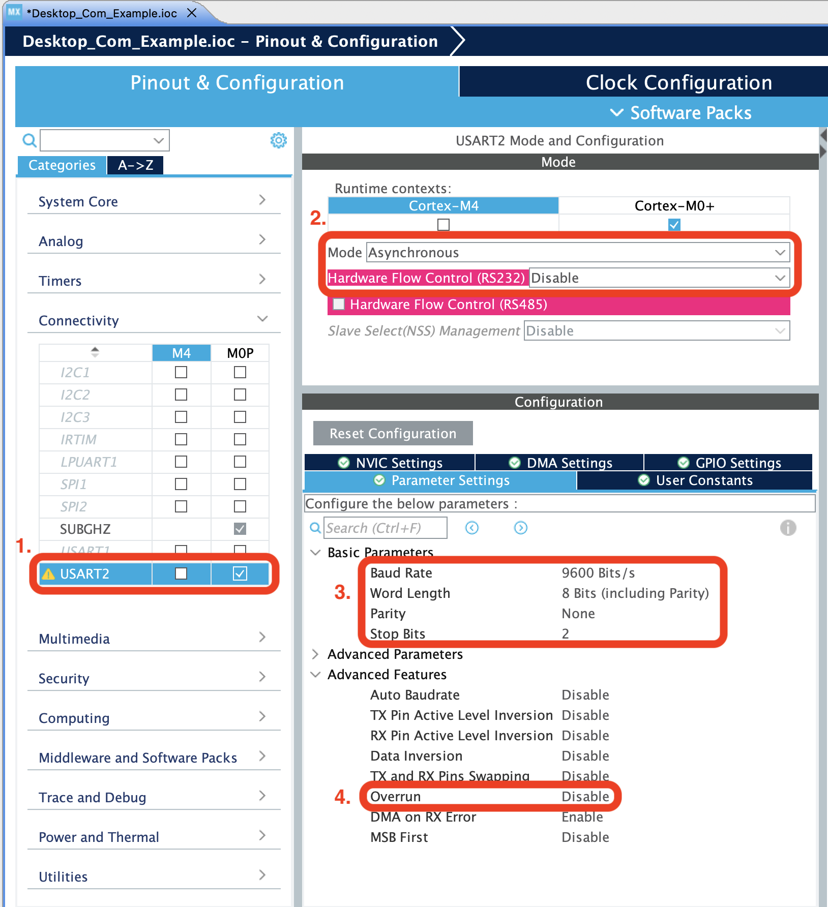
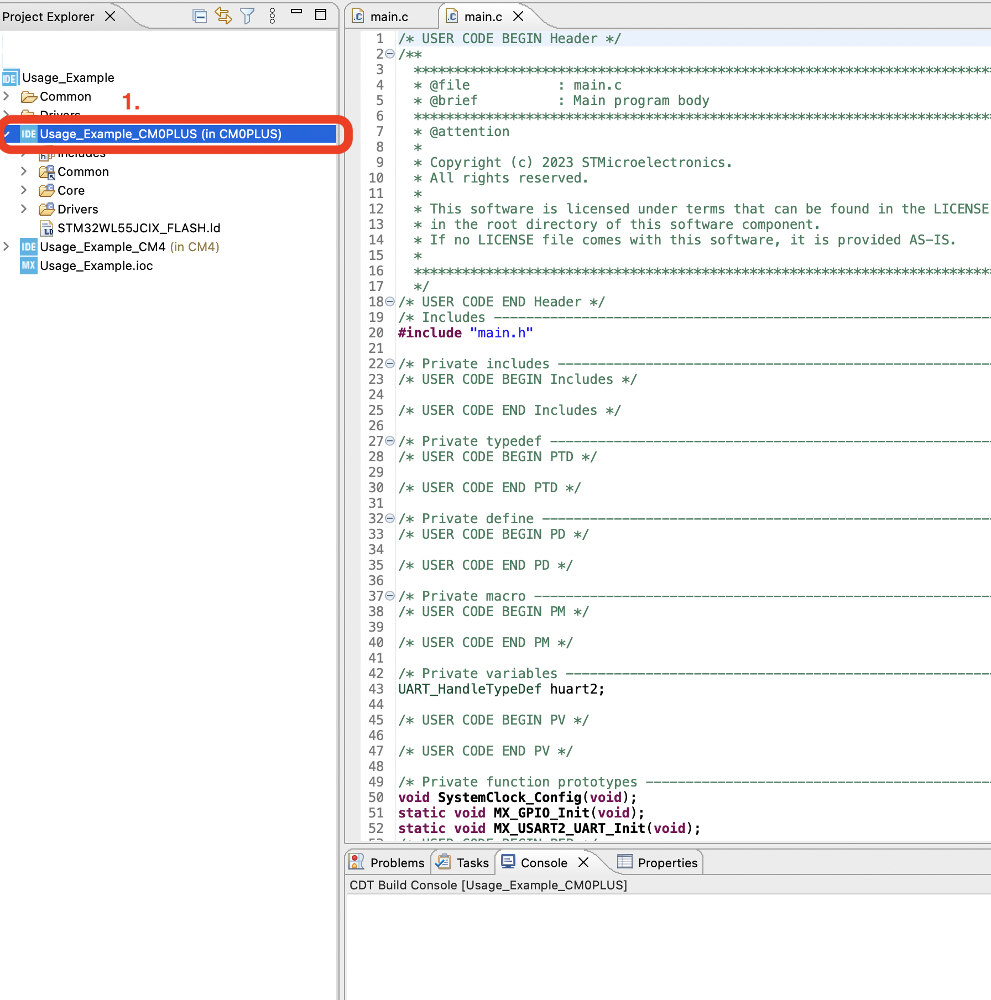
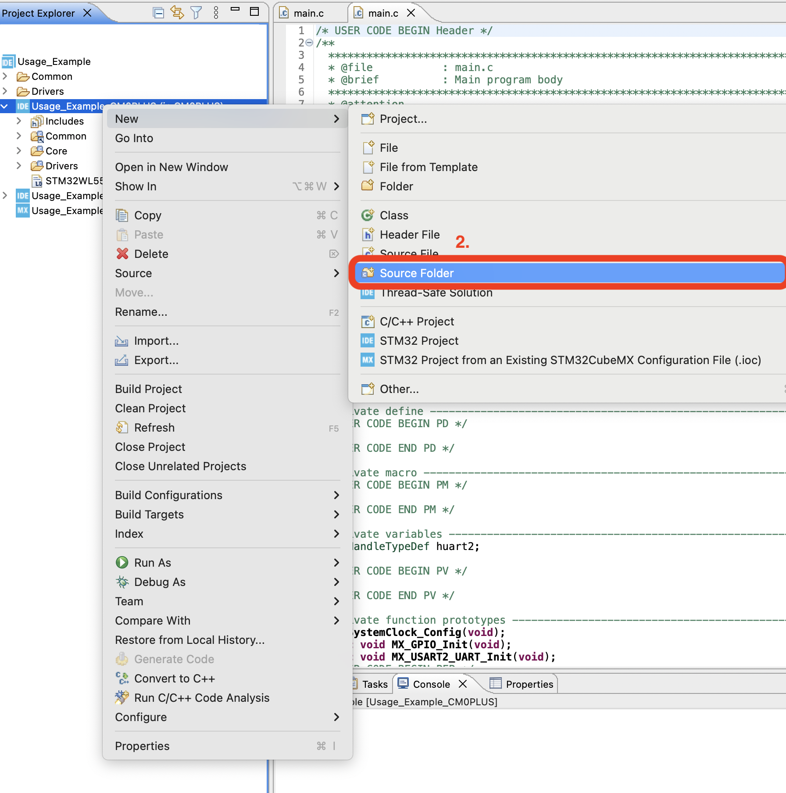
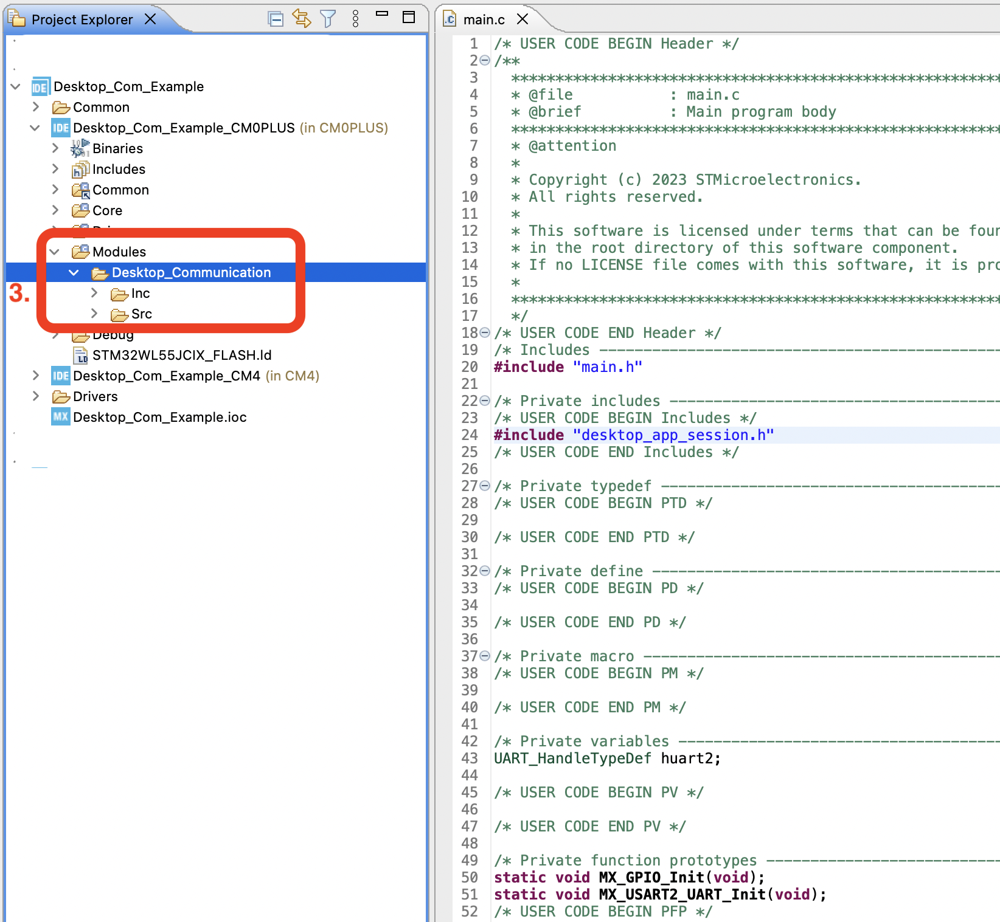
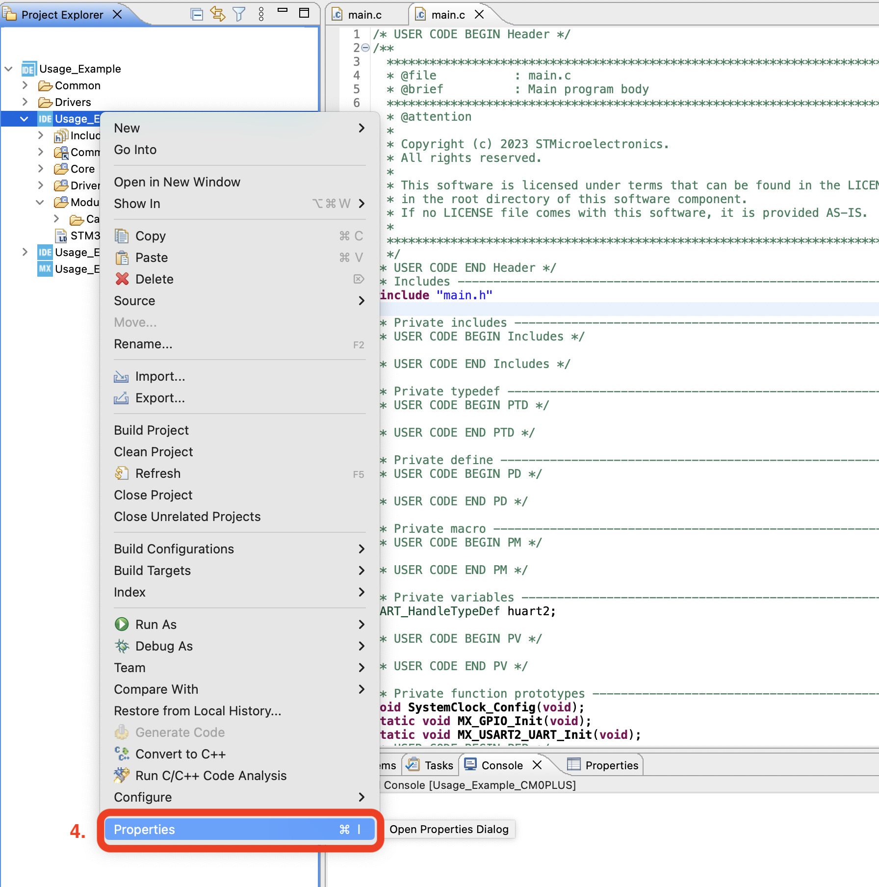
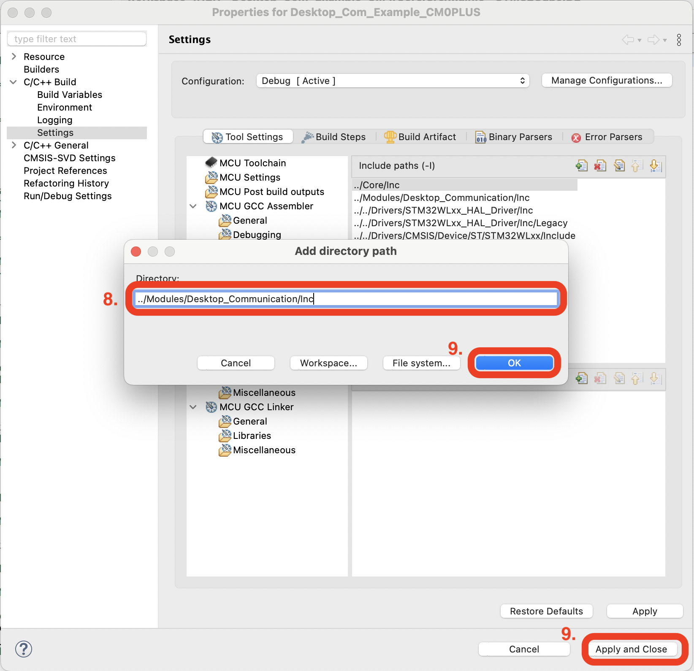
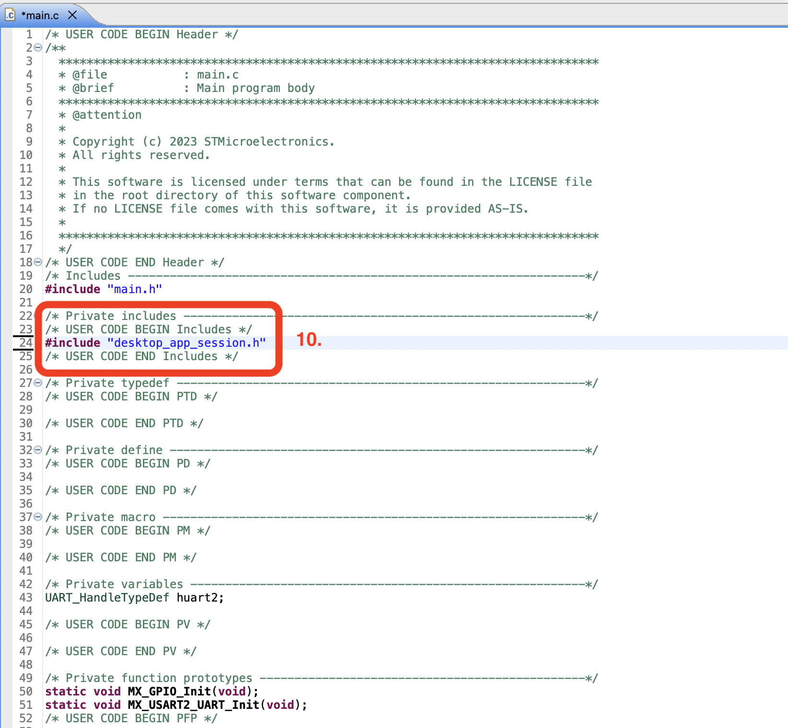

# STM32WL5x Desktop Communication

The STM32WL5x Desktop Communication module provides a slightly-more-than basic communication module for the Nucleo-WL55JCx development board.  A set of python scripts for a desktop and an MCU module are provided as a pair for sending messages between a desktop and the Nucleo-WL55JCx development board.

___

## Conceptual Design

The Desktop Communication module was developed out of the need to program settings to and read settings and data from a Nucleo-WL55JCx development board.  A desktop computer acts as a master with the MCU as a slave, sending tasks to the MCU or requesting information from the MCU.  The module encapsulates this functionality and provides an API for use on both the MCU and the desktop, allowing a programmer to design their applications around it.

At the highest level, the module establishes communication sessions between a python desktop application and the MCU's main loop.  Within an session, the desktop can interact with the MCU over serial communication.  For more into how the communication works see the *Protocol* section.

___

## Installation/Usage

### NUCLEO

To use the Desktop Communication module on your Nucleo development board add the provided directory to your STM32CubeMX project and include mode_timer.h.

#### STM32CubeMX Configuration

Before you can use the module a hardware timer must be enabled an configured.  **One possible configuration is as follows:**

1. Open the STM32CubeMX configuration tool within your project and enable the USART2 on the core you would like to develop within.
2. Make sure the mode is asynchronous and RS-232 flow control is disabled.  These settings are for compatibility with the UART to VCOM chip the Nucleo development board uses.
3. Set the baud rate to 9600 Bits/s, the word length to 8 bits (including parity), the parity to None, and the number of stop bits to 2.  These settings are for compatibility with the desktop test application provided, but make sure these are identical between both the MCU and the desktop application's settings.
4. Set the overrun option to Disable.  The module does not perform any handling of an overrun.



#### Adding to Your STM32CubeMX Project

Now you are ready to add the module code.  Create a new source folder and add the module's header files to the compiler's include directory.

1. Right click on the sub-project for the core you want to use the module in.
2. Navigate to New > Source Folder.
3. Name the new Source Folder Modules.  Copy the Desktop_Communication folder into here.
4. Right click again on the same sub-project.  Navigate to Properties.
5. On the left side, navigate to C/C++ Build > Settings.
6. Within that window navigate to MCU GCC Compiler > Include Paths.
7. Add a new Include Path.
8. Enter "../Modules/Desktop_Communication/Inc".
9. Click Okay and exit the window.
10. Now include "desktop_app_session.h" in the file you want to use it within.









### Desktop

todo: making a new dir for desktop app
todo: add pyserial stuff here

### Example Usage

A simple usage example STM32CubeMX project is provided along with a sample Desktop Application.  This example shows the session-level command "ECHO" and a custom application-level command "LED".  The ECHO command just asks the MCU to echo back the message exactly as it was received, which can be useful for testing purposes.  The LED command we will define to toggle the blue LED on the Nucleo development board.

First, lets look at the MCU.

#### MCU

For a more interesting example I have included an additional module called LED Debug.  All it does is provide some basic functionality to turn on and off the LEDs on the STM32WL55JC development board.

On most STM32 development boards the USART 2 is connected to the VCOM used to
communicate with the desktop.  After initializing the USART 2 in the HAL, the desktop application session manager can be initialized:

    // initialize the Desktop App Communication
    desktopAppSession_init(&huart2);

Within the main loop, call the session manager to try to open a session with the desktop application.  Toggle the green LED to signal while the session is open.

    // Attempt to open a session,
    // will skip attempt if a session is already open
    if (desktopAppSession_start() == SESSION_OKAY)
        // if a session was opened, turn on the green LED
        activate_led(GREEN_LED);
    else
        // if the session is closed, turn off green LED
        deactivate_led(GREEN_LED);

Make a call to update the session manager.  If the session is not open this no update is performed.

    // update the session manager
    desktopAppSession_update();

Now, check for any queued commands from the desktop application.  Again, if the session is not open this is skipped.  If a message is received that gives the command to toggle the blue LED, toggle it and report to the desktop that it has been toggled.  This command is given through a message with the header "LED" and the body "toggle blue LED".

```
    // get message from desktop if there is one
    if (desktopAppSession_dequeueMessage(message_command_buffer, message_payload_buffer) == SESSION_OKAY)
    {
        // if the command is "LED/0" and payload is "toggle blue LED\0", toggle the blue LED
        if (!strncmp(message_command_buffer, "LED\0", UART_PACKET_HEADER_SIZE)
                && !strncmp(message_payload_buffer, "toggle blue LED\0", UART_PACKET_PAYLOAD_SIZE))
        {
            if (!blueLedOn)
            {
                // turn led on
                activate_led(BLUE_LED);
                blueLedOn = 1;

                // report it to desktop
                memset(message_payload_buffer, 0, sizeof(char) * UART_PACKET_PAYLOAD_SIZE);
                strncpy(message_payload_buffer, "blue LED is now on\0", sizeof(char) * UART_PACKET_PAYLOAD_SIZE);
                desktopAppSession_enqueueMessage("LED/0", message_payload_buffer);
                // Note that this only enqueues the message to be sent the next time
                // desktopAppSession_update() is called.
            }
            else
            {
                // turn led off
                deactivate_led(BLUE_LED);
                blueLedOn = 0;

                // report it to desktop
                memset(message_payload_buffer, 0, sizeof(char) * UART_PACKET_PAYLOAD_SIZE);
                strncpy(message_payload_buffer, "blue LED is now off\0", sizeof(char) * UART_PACKET_PAYLOAD_SIZE);
                desktopAppSession_enqueueMessage("LED/0", message_payload_buffer);
                // Note that this only enqueues the message to be sent the next time
                // desktopAppSession_update() is called.
            }
        }
    }
```

#### Desktop

Now let us look at the desktop application to interface with this.  The example desktop application provides additional framework to help identify what port the MCU will be connected to based on the desktop's OS.  I will skip over this.

To open a session, call:

    # attempt to make connection
    Stm32Session = SerialSession.STM32SerialCom(availablePort)

Now send an ECHO command and an LED command, repeating for a total of 20 commands.  Also, listen for the messages sent back from the MCU at the end of each iteration.

```
    for _ in range(10):
        # sleep for 1 second for easy watching of terminal
        time.sleep(1)

        # queue an echo message with a random payload
        Stm32Session._outMessageQueue.put(('ECHO','Hello World! {}'.format(random.randrange(200))))

        # queue a command to toggle the blue LED
        Stm32Session._outMessageQueue.put(('LED\0', 'toggle blue LED'))

        # update the session (send and receive messages with MCU)
        Stm32Session.update()

        # if the MCU sent any messages, print them to the terminal
        while not Stm32Session._inMessageQueue.empty():
            print(Stm32Session._inMessageQueue.get()[1])
```

Call the desktop application by opening a terminal in the folder containing Desktop_App_Example.py and call this file with:

    python3 Desktop_App_Example.py

You will get an output like the following.  If you get three lines that say there was a malformed packet, try again at least once.  If that doesn't fix it, reset the MCU and try again.

    Connected to port /dev/tty.usbmodem143403
      ::SENDING::  ECHOHello World! 130
      ::SENDING::  LEDtoggle blue LED
      ::RECEIVED::  Hello World! 130
      ::SENDING::  ECHOHello World! 192
      ::SENDING::  LEDtoggle blue LED
      ::RECEIVED::  blue LED is now on
      ::RECEIVED::  Hello World! 192
      ::SENDING::  ECHOHello World! 136
      ::SENDING::  LEDtoggle blue LED
      ::RECEIVED::  blue LED is now off
      ::RECEIVED::  Hello World! 136
      ::SENDING::  ECHOHello World! 148
      ::SENDING::  LEDtoggle blue LED
      ::RECEIVED::  blue LED is now on
      ::RECEIVED::  Hello World! 148
      ::SENDING::  ECHOHello World! 0
      ::SENDING::  LEDtoggle blue LED
      ::RECEIVED::  blue LED is now off
      ::RECEIVED::  Hello World! 0
      ::SENDING::  ECHOHello World! 42
      ::SENDING::  LEDtoggle blue LED
      ::RECEIVED::  blue LED is now on
      ::RECEIVED::  Hello World! 42
      ::SENDING::  ECHOHello World! 14
      ::SENDING::  LEDtoggle blue LED
      ::RECEIVED::  blue LED is now off
      ::RECEIVED::  Hello World! 14
      ::SENDING::  ECHOHello World! 57
      ::SENDING::  LEDtoggle blue LED
      ::RECEIVED::  blue LED is now on
      ::RECEIVED::  Hello World! 57
      ::SENDING::  ECHOHello World! 116
      ::SENDING::  LEDtoggle blue LED
      ::RECEIVED::  blue LED is now off
      ::RECEIVED::  Hello World! 116
      ::SENDING::  ECHOHello World! 74
      ::SENDING::  LEDtoggle blue LED
      ::RECEIVED::  blue LED is now on
      ::RECEIVED::  Hello World! 74
      ::DISCONNECTING::  Port /dev/tty.usbmodem143403
    Disconnected from port /dev/tty.usbmodem143403

Let's dissect this output.  A connection is established and a session is opened on port "/dev/tty.usbmodem143403".  Then all the messages exchanged with the MCU.  Most notably, reports from the MCU seem like they are off in timing.  Take a look at the first six messages exchanged.  The MCU echoes the first echo command immediately but the MCU does not report turning the LED on until one iteration later.  This is because session-level commands (i.e. ECHO) are responded to immediately where the application-level messages are queued and sent from the MCU when it gets around to it, and before any new messages are received from the desktop.  In our example program this is at the start of the main loop.  This example highlights how the desktop application must not expect all messages from the MCU to arrive in a particular order.

___

## Notable Design Choices and Limitations

todo mention necessity of systick for HAL

### Protocol


___

## API

### Return Codes

1. **MODE_TIMER_STATUS** - Status code returns from API function calls to signal if the call was successful or why the call was unsuccessful:
    - **MODE_TIMER_OKAY** - API function call was successfully completed.
    - **MODE_TIMER_NOT_INIT** - The Mode Timer module has not been initialized before API call.

### Functions

1. **bool modeTimer_init(LPTIM_HandleTypeDef* const hlptim)** - Initialize the mode timer module.  Must be called before the module can operate.
    - Parameters:
        - **hlptim** - pointer to LPTIM_HandleTypeDef (HAL handle) for a low-powered timer.
    - Return:
        - **bool** - false if the pointer passed was NULL, true otherwise.
